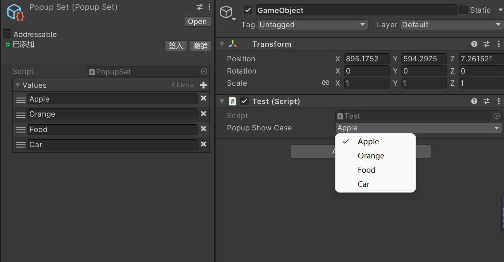

# AkiPopup Info
 Easy Popup Attribute to select string in a database for Unity

 Author: [AkiKurisu](https://github.com/AkiKurisu)



# How to use

1. Using ```PopupSelector``` Attribute to decorate string field.
2. It will automatically create a DataSet in your asset folder.
3. You can now select any string in the popup menu easily.

```c#
public class Test:MonoBehaviour
{
    [SerializeField,PopupSelector]
    private string popUpValue;
}
```

# How to implement
1. Creating new C# scripts and implements ```PopupSet``` class.
2. You can now adding type to the ```PopupSelector``` Attribute to use specied DataSet.
   
```c#
public class NewDataSet:PopupSet
{

}
public class Test:MonoBehaviour
{
    [SerializeField,PopupSelector(typeof(NewDataSet))]
    private string popUpValue;
}
```