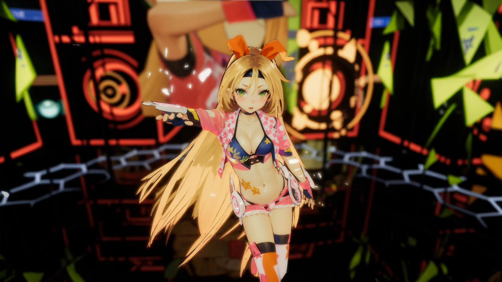
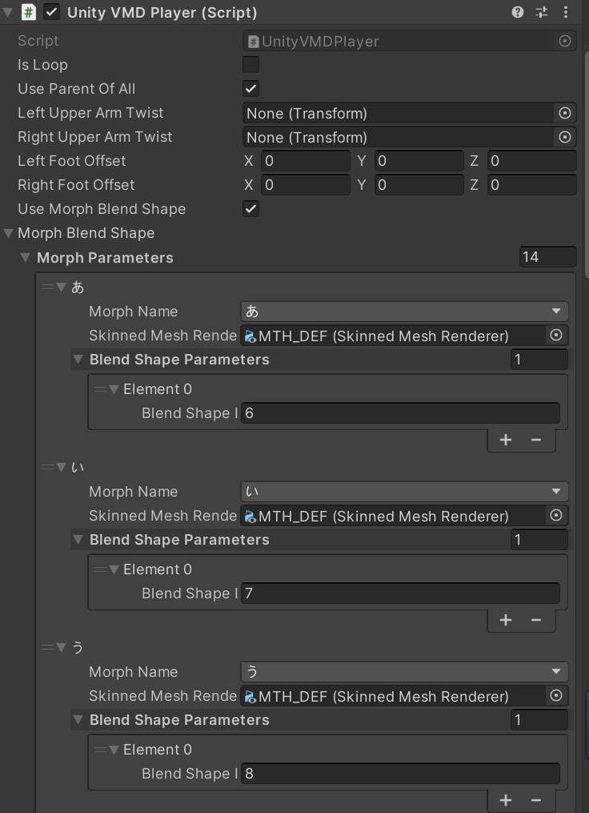

# Introduction to Unity Chan Dance

***Read this document in other languages: [中文文档](./README_ZH.md)***


## 【Supported version】

This project supports Unity 2021.3.18f1 and above

## 【Demo Video】

https://www.bilibili.com/video/BV1Pj411z7p3/



## 【Build Version Download】

### [UnityChanDance.zip](https://github.com/AkiKurisu/UnityChanDance/releases/download/V0.1/UnityChanDance.zip)

## 【Project Instruction】
- This project is upgraded from [unity3d-jp-Unity-Chan "Candy Rock Star"](https://github.com/unity3d-jp/unitychan-crs),
- URP version stage comes from [ctiao-urp-unitychan-stage](https://github.com/ctiao/urp-unitychan-stage)
- The Shader used by UnityChan is [unity3d-jp-Unity-Chan Toon Shader 2.0](https://github.com/unity3d-jp/UnityChanToonShaderVer2_Project) version 1.5.1 (additionally fixed bugs compatible with URP12 and above (https: //github.com/unity3d-jp/UnityChanToonShaderVer2_Project/issues/122))
- VMDPlayer is modified from [hobosore-UnityVMDPlayer](https://github.com/hobosore/UnityVMDPlayer)

## 【Plugin Description】

1. The Build version uses the paid plugin [Magica Cloth 2](https://assetstore.unity.com/packages/tools/physics/magica-cloth-2-242307) for mesh-based cloth and hair simulation. not included in this project
2. If there is no above-mentioned plugin, you can use External/UnityChan/Prefabs/UnityChan_Legacy to perform, that is, use UnityChan's native Spring components completely
3. If you have Magica Cloth 2, you can use External/UnityChan/Prefabs/UnityChan_Pro to perform for better visual effects

## 【How to play MMD】
1. Enter the game Data directory (Assets folder in Editor)
2. Place the .vmd file and .wav audio in the recorded VMD folder
3. The configuration table is the UserConfig.json file in this directory
4. Modify the relative path of AudioPath and VMDPath
```json
{
     "AudioPath": "CHUNG HA - Snapping.wav",
     "VMDPath": "Snapping.vmd"
}
```
5. Start the game

## 【Description of Morph】
Since UnityChan's BlendShape does not conform to the MMD name specification, the project uses the MorphBlendShape function for mapping. If you use other characters that do not have this name specification problem, you can uncheck ```Use Morph BlendShape```

