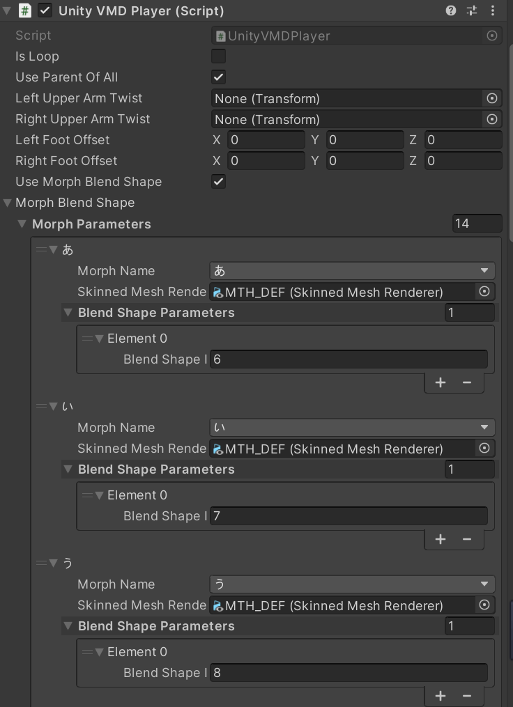

# Unity Chan Dance 简介

***Read this document in other languages: [English Document](./README.md)***  


## 【支持版本】

本项目支持Unity 2021.3.18及以上

## 【演示视频】

https://www.bilibili.com/video/BV1Pj411z7p3/


## 【打包下载】

### [UnityChanDance.zip](https://github.com/AkiKurisu/UnityChanDance/releases/download/V0.1/UnityChanDance.zip)

## 【项目说明】
- 本项目升级自[unity3d-jp-Unity-Chan "Candy Rock Star"](https://github.com/unity3d-jp/unitychan-crs),
- URP版本舞台来自[ctiao-urp-unitychan-stage](https://github.com/ctiao/urp-unitychan-stage)
- UnityChan所使用Shader为[unity3d-jp-Unity-Chan Toon Shader 2.0](https://github.com/unity3d-jp/UnityChanToonShaderVer2_Project) 1.5.1版本 (额外修复了兼容URP12及以上的bug(https://github.com/unity3d-jp/UnityChanToonShaderVer2_Project/issues/122))
- VMDPlayer修改自[hobosore-UnityVMDPlayer](https://github.com/hobosore/UnityVMDPlayer)

## 【插件说明】

1. Build版本使用了付费插件[Magica Cloth 2](https://assetstore.unity.com/packages/tools/physics/magica-cloth-2-242307)进行基于网格的布料和头发模拟,该插件不包含在此项目中
2. 如没有上述插件，可以使用External/UnityChan/Prefabs/UnityChan_Legacy进行演出,即完全使用UnityChan原生的Spring组件
3. 如果你拥有Magica Cloth 2, 可以使用External/UnityChan/Prefabs/UnityChan_Pro进行演出,获得更好的视觉效果

## 【MMD播放流程】
1. 进入游戏Data目录下(Editor中为Assets文件夹)
2. 将.vmd文件和.wav音频放置于该录下的VMD文件夹中
3. 配置表为该目录下的UserConfig.json文件
4. 修改AudioPath和VMDPath的相对路径
```json
{
    "AudioPath": "CHUNG HA - Snapping.wav",
    "VMDPath": "Snapping.vmd"
}
```
5. 开始游戏

## 【Morph说明】
由于UnityChan的BlendShape不符合MMD的名称规范，项目中使用了MorphBlendShape功能进行了映射，如果你使用的其他角色没有该名称规范问题可以不勾选```Use Morph BlendShape```

